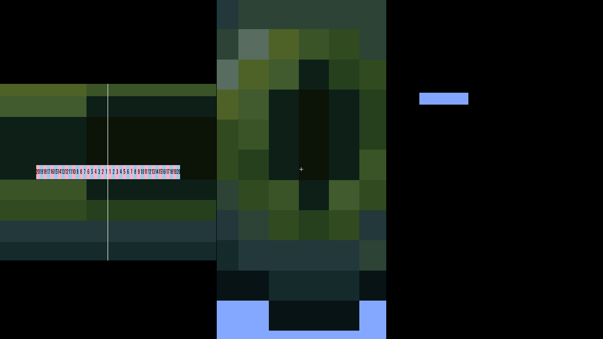
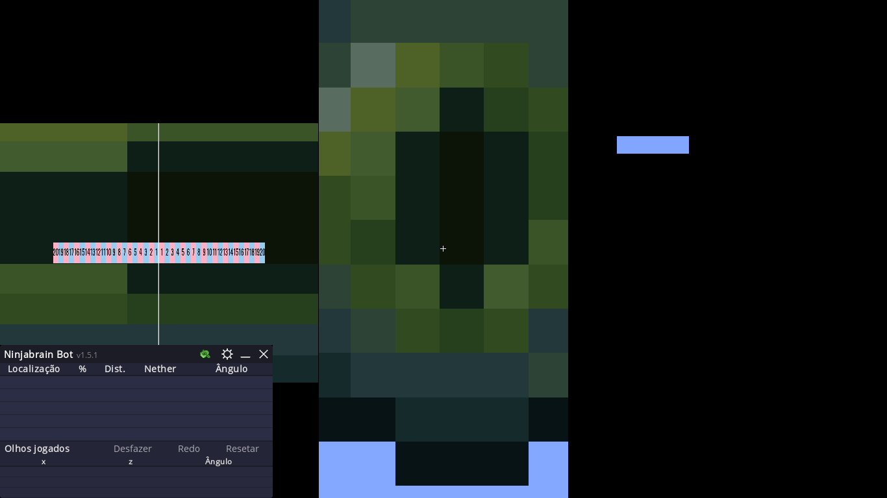
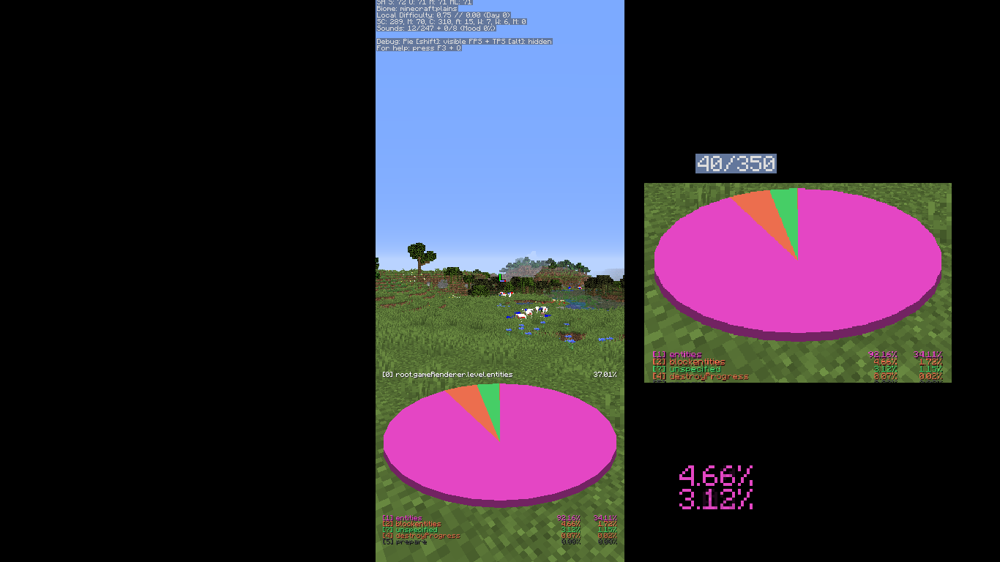
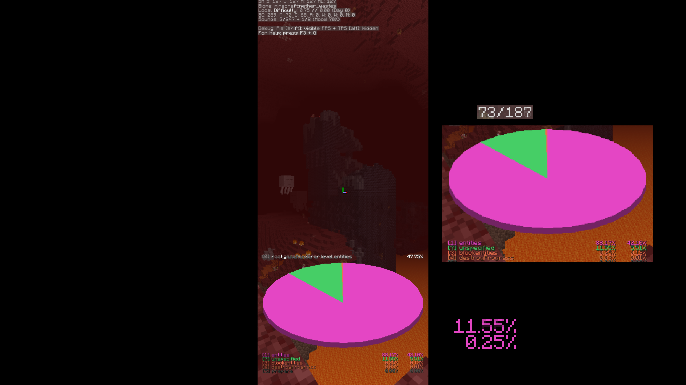
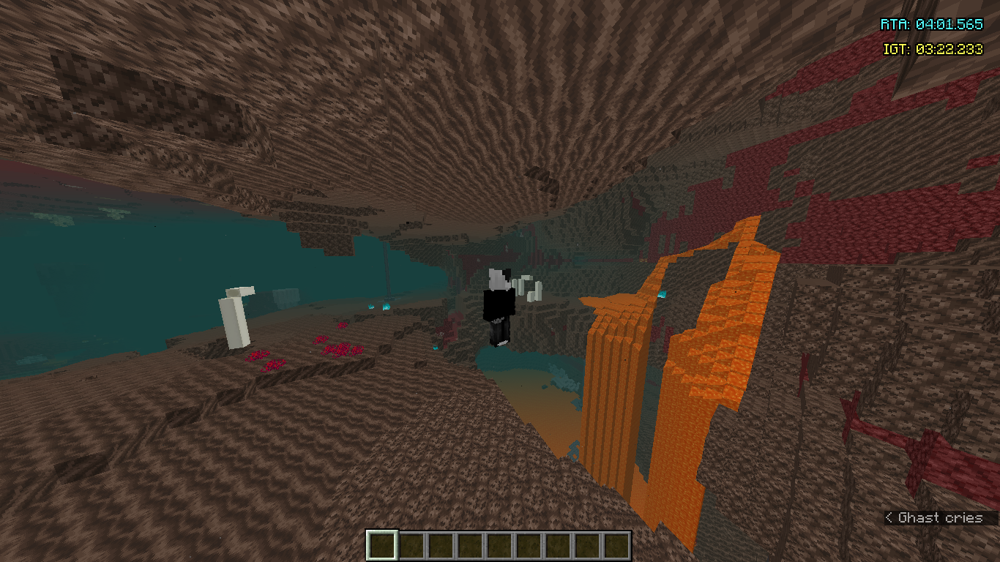
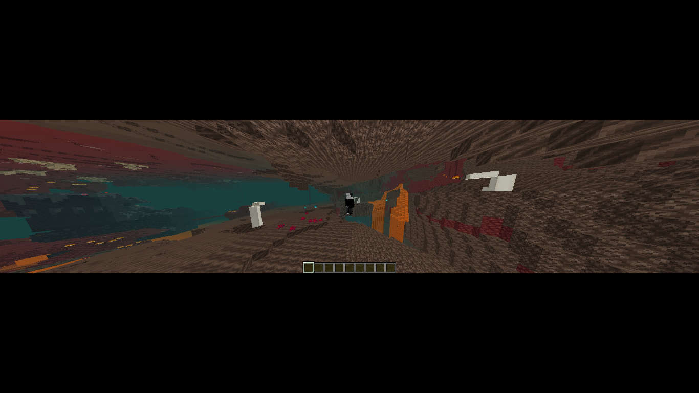

# Waywall Config — 1366x768

[](https://github.com/gustavogordoni/waywall-config/commits/)
[](https://github.com/gustavogordoni/waywall-config/blob/main/LICENSE)

## Introduction

This repository is a modified version of **[Waywall Generic Config](https://github.com/arjuncgore/waywall_generic_config)**, adapted to work as correctly as possible on **1366x768** displays.

[Versão em Português](README.md)

## Description

This version focuses on adjusting **mirrors, overlays, and resolutions** for 1366x768 screens, while preserving the original behavior and features of the base config.

Most changes involve fine-tuning **element sizes, positions, and scaling**, ensuring better alignment and usability on this specific resolution.

## Installation

Clone this repository directly into your Waywall config directory:

```bash
git clone https://github.com/gustavogordoni/waywall-config ~/.config/waywall
```

If you already have an existing config and want to back it up:

```bash
mv ~/.config/waywall ~/.config/waywall.bkp
git clone https://github.com/gustavogordoni/waywall-config ~/.config/waywall
```

## Screenshots





<!--  -->


<details>
<summary><strong>Detailed explanation of the screenshots</strong></summary>

### Tall (Measurement mirror / Eye throws)

The images above show the **Tall mode**, toggled with **F2**.

This mode displays a vertical mirror that allows accurate **Ender Eye throw measurements** using **Ninjabrain Bot**.
It is also fully compatible with **Boat Eye**, supporting both boat and non-boat measurements depending on your sensitivity setup.

This setup is ideal for:

* Measuring eye throws with Ninjabrain Bot
* Using Boat Eye on Wayland
* Working with automatically adjusted sensitivity via Waywall


---

### Thin (Entity count / Pie Chart)

**Thin mode** is activated using **Left Alt**.

This mode narrows the screen, making it easier to **read entity counts in a specific direction**, which is extremely useful for:

* Finding **Bastions** in the Nether
* Efficient **Pie Chart** usage
* Searching for **Buried Treasure**
* Scanning **Strongholds** and locating the portal room more easily


---

### Wide (Fog reduction / Nether exploration)

**Wide mode** is activated using the **B** key.

This mode compresses the image vertically and stretches it horizontally, which significantly **reduces in-game fog**, especially in the Nether.

It is extremely useful for:

* Locating **Nether Fortresses**
* Finding **Bastions**
* Exploring large Nether areas with improved visibility

Comparison below:

* **Image 1**: normal view (Wide disabled)
* **Image 2**: Wide enabled — the bastion becomes visible


</details>

## Credits

Original config and project base:
[https://github.com/arjuncgore/waywall_generic_config](https://github.com/arjuncgore/waywall_generic_config)